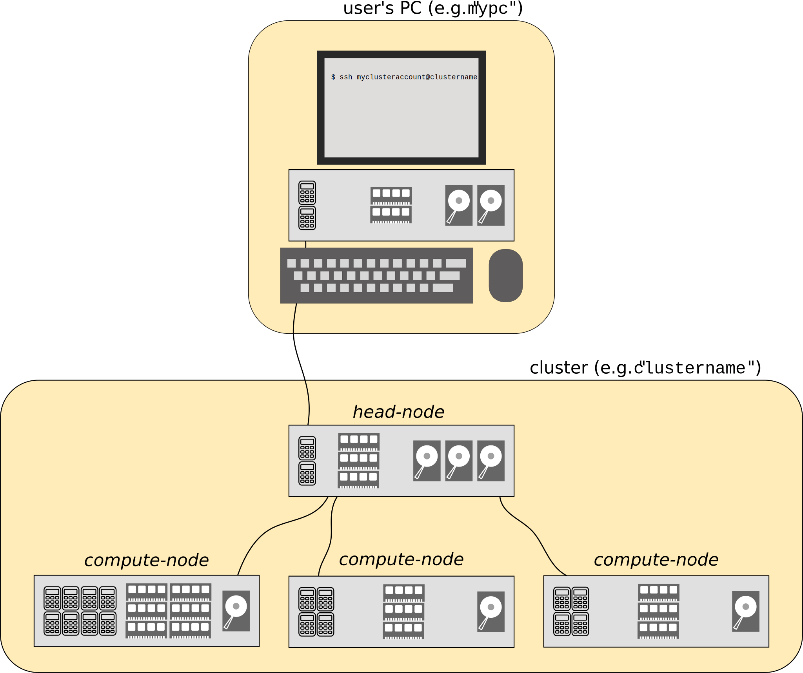

########
Clusters
########

Basic cluster layout
--------------------

The basic layout of a cluster is shown in the image below. The cluster consists of a *head-node* and several *compute-nodes*. The head-node is the "computer" you log in to from your own PC. From the head-node, jobs are distributed to the compute-nodes by a scheduler: the *queuing system*. The scheduler sends the job to a compute-node when a free spot with the requested resources is available. Running a job thus corresponds to submitting a special (Bash-)script to the scheduler. You don't know a priori when, or on which compute-node, your job will be handled.

Connecting, File Transfer and Editing
-------------------------------------

The clusters run on Linux and you interface to them using a service called "ssh", which is short for Secure SHell. This service can present a remote Command Line Interface (CLI) over a network. In Layman's terms, *it allows you to type commands from your own computer which are executed on the cluster*. An ssh-client is therefore needed, which can be obtained for any operating system.

Additionally, before and after running a job, the relevant files have to be transferred to and from the cluster respectively. Below we discuss several interfaces for either Linux/macOS or Windows users. It is remarked that generally copying actions/commands run on the users' computer, not on the cluster.

Connecting and File Transfer from Windows
^^^^^^^^^^^^^^^^^^^^^^^^^^^^^^^^^^^^^^^^^

To connect to the cluster from Windows, first a ssh-client is required. Several options exist, for example:

* `SSH Secure Shell (shareware) <http://software.sites.unc.edu/shareware/#s>`_.

* `PuTTy (free) <http://www.putty.org/>`_.

* `cygwin (free) <https://www.cygwin.com/>`_: provides a Linux-like environment on Windows.

* `git (free) <https://git-scm.com/download/win>`_. Git is actually a version management system, but it also includes a BASH-shell on Windows.

* `FileZilla (free) <https://filezilla-project.org/>`_ can be used to transfer files to and from the clusters.

Connecting and File Transfer from Linux/macOS
^^^^^^^^^^^^^^^^^^^^^^^^^^^^^^^^^^^^^^^^^^^^^

Connecting
""""""""""

Almost all Linux/macOS distributions have a ssh-client installed. To log in to the *furnace* cluster, open a terminal window on your own computer, and execute:

.. code-block:: bash

  [username@mypc ~]$  ssh myclusteraccount@clustername

If this is the first time, ssh will ask you to confirm the identity of the computer you are connecting to. Confirm the question, and enter your password to log in on the cluster.

To avoid the need to provide the user's password on each login, a key can be generated on the host computer and provided to the cluster. If still logged in on the *furnace*, hit ``Ctrl-D`` or type ``exit`` to log out and return to your own computer. Then follow these steps:

1. Generate a key on your own computer:

   .. code-block:: bash

     [username@mypc ~]$  ssh-keygen -t dsa

   confirm each question with ``Return``.

2. Copy the key to the cluster with:

   .. code-block:: bash

     [username@mypc ~]$  ssh-copy-id myclusteraccount@clustername

If done right, from now on logging in will be password-less.

File transfer
"""""""""""""

There are several file transfer options, partially depending on the Linux/macOS distribution used:

*   Using a file browser (e.g. Nautilus for Gnome, or Dolphin for KDE). Open the browser and type ``sftp://myclusteraccount@clustername`` in the address bar (or location bar).

*   Using ``scp`` from the command line. This command is completely analogous to the ``cp`` command (see :ref:`sec-bash`). To copy files to the cluster (e.g. *furnace*) type in your local prompt:

    .. code-block:: bash

      [username@mypc ~]$  scp somepath myclusteraccount@clustername:someclusterpath

    where ``somepath`` (and ``myclusteraccount`` and ``clustername``) should be replaced. To copy files from the cluster back to the users' computer, the source and the destination should be reversed:

    .. code-block:: bash

       [username@mypc ~]$  scp myclusteraccount@clustername:someclusterpath somepath

    Note that to copy folders ``-r`` should be added after ``scp``.

*   The more advanced user may want to take a look at the ``rsync`` command, which can perform fast transfer/synchronization.

Editing Scripts
^^^^^^^^^^^^^^^

Here, some basic examples are given to edit files/scripts. There are basically two ways of doing this

1.  Copy the file to your own computer, and then edit it with your favourite text/script editor (e.g. with code highlighting), and finally copy the file back to the cluster. This option is recommended for large modifications to a script, and usually is easier to manage in terms of versions.

2.  Edit the file on the cluster with an editor that runs in the command line from a shell on the cluster. This option is recommended for small script modifications.

    There are several command line based text editors available on the clusters (and on most other :ref:`sec-linux` machines) named ``vi``, ``emacs``, and ``nano``. The first two are advanced and powerful, but are extremely beginner unfriendly.
