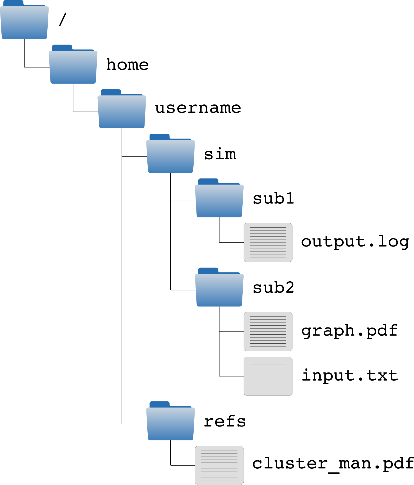

.. _sec-linux:

#####
Linux
#####

Most clusters run on a Linux Operating System (OS). Other examples of operating systems are Windows or Mac OSx. Linux operating systems are also known as "Distributions" because they basically are a collection of software packages, which are "distributed" to the users. Popular Linux distributions are: Ubuntu, Fedora, RedHat, CentOS and openSuse, but there are many more (see for example `distrowatch <http://www.distrowatch.com>`_ for an overview of all distributions).

The (mis)use of the name
========================

Within this software collection, almost always a package called Linux is found, which is the "kernel". This particular piece of software is very important, because it handles the connection between the hardware and all the other pieces of software. However, when people speak about Linux, they typically mean a distribution containing Linux. It is like calling an airplane by the name of its engine, which is a bit awkward, but this is just how it is.

Most users never interact with the "kernel", they experience the pieces of software that provide the user interface (UI). UIs come in two flavours, the Graphical User Interface (GUI) and the Command Line Interface (CLI). When you install a Linux Distribution on your own computer, it typically comes with a GUI or desktop environment, e.g. Gnome and KDE. Typically clusters only offer a CLI, which is basically a terminal ("window") which presents you a prompt, where you can type a command.

Linux file structure
====================

* Directories (folders) are delimited with a ``/`` (instead of a ``\`` in Windows).

* The top most directory (or root) is called ``/``. Hard-drives, other media, or even remote file systems can be mounted anywhere. For example a USB drive is commonly mounted at ``/media/mystick``. In contrast to Windows where each drive has a different name in the file tree (e.g. ``C:\``).

* All characters can be used in directory and file names, but it is best not to use exotic characters (e.g. ``*``, ``"``, ``'``).

* File (and directory) names starting with a ``.`` are hidden files, and are not visible by default.

* Files (and directories) have owners and permissions, preventing misuse or accidental removal.

* Each user has his or her own home-folder which is typically located at ``/home/myusername``.

.. _sec-bash:

The BASH-shell
==============

To interact with the Linux operating system a Shell is used. In this command line environment, commands given by the user are interpreted by the Shell. Several Shells exist, each with its own syntax and built-in commands. One of the most popular is the Bash-shell.

Before introducing several features of the Bash-shell it is useful to discuss the basic controls. In principle the only form of control is through the keyboard. The exception is copying and pasting (parts) of commands, which is **exclusively** done using the mouse. ``Crtl+c``, ``Crtl+v``, etc. have a different meaning (see below). Specifically, highlighted text is automatically copied to the clipboard. It is pasted using the middle mouse button. Alternatively, the ``copy`` and ``paste`` command can be reached through the right mouse button. Several other basic controls are listed below.

* Each command follows a prompt that is displayed by the terminal. For example:

  .. code-block:: bash

    [username@hostname ~]$

* A command is followed by ``return`` to execute the command.

* By pressing ``TAB``, Bash will try to auto-complete your typed command, pressing ``TAB`` twice will print auto-complete suggestions.

* To stop a command ``Ctrl+c`` is used. It is advised **not** to use ``Ctrl+z`` or ``Ctrl+s`` which, respectively, sleeps or freezes a command.

* To move the location of the cursor (by definition only possible inside the current command) the keys :math:`\leftarrow`, :math:`\rightarrow`, ``Home``, and ``End``  can be used.

* To move through the history the keys :math:`\uparrow` and :math:`\downarrow` are used. Alternatively, the history can be searched using ``Crtl+r`` followed by keywords. To progress through the selection, use ``Crtl+r``. It is noticed that when pressing ``return`` the selected command is directly executed. Use the :math:`\rightarrow` to edit the selected command in stead.

* To log-out ``Crtl+d`` is used, this is equivalent of typing ``exit``.

Commands
--------

.. contents::
  :local:
  :depth: 2
  :backlinks: top

Overview
^^^^^^^^

In general a command consists of three parts: the command, options, and input arguments. Without going into detail, we consider an example. The command

.. code-block:: bash

  [username@hostname ~]$  tar -czp -f outputname.tar.gz foldername

creates a compressed archive. This command can be divided as follows

.. code-block:: bash

  prompt $ command <options> arguments

  # prompt:   [username@hostname ~]$
  # command:  tar
  # options:  -czp -f outputname.tar.gz
  # argument: foldername

From this, we observe that different parts of the command are separated by spaces. Also, we observe that options begin with a "``-``". Furthermore some options require an argument. As is observed for the ``-f`` option, the argument directly follows the option. Finally, it is remarked that options are commonly combined. In the command above the options ``-c``, ``-z`` and ``-p`` are grouped to ``-czp``.

Most commands have a manual page. This page is found using

.. code-block:: bash

  [username@hostname ~]$  man commandname

This opens a simple text-viewer. Using the :math:`\downarrow` / :math:`\uparrow`, ``PageUp`` / ``PageDown``, and the scroll wheel on the mouse one can scroll through the manual page. To search the manual use ``/`` followed by your query, and ``n`` to progress through the search results. To close the editor type ``q``. The ``man`` command prompts accept the same commands as the ``less``-viewer.

Alternatively (or sometimes exclusively), a (short) manual page can often be printed to the screen. This is provided by the command itself, i.e.

.. code-block:: bash

  [username@hostname ~]$  commandname -h
  [username@hostname ~]$  commandname --help

Several useful commands are listed, the most important ones are elaborated in the following sections.

================= ==============================================================
Command           Description
================= ==============================================================
:command:`pwd`    print the current working directory
----------------- --------------------------------------------------------------
:command:`ls`     list directory contents
----------------- --------------------------------------------------------------
:command:`du`     report disk usage of files
----------------- --------------------------------------------------------------
:command:`find`   search and find files
----------------- --------------------------------------------------------------
:command:`cd`     change directory
----------------- --------------------------------------------------------------
:command:`mkdir`  make a directory
----------------- --------------------------------------------------------------
:command:`cp`     copy files (and directories with the ``-r`` option)
----------------- --------------------------------------------------------------
:command:`mv`     move (rename) files and directories
----------------- --------------------------------------------------------------
:command:`rm`     remove files (and directories with the ``-r`` option)
----------------- --------------------------------------------------------------
:command:`cat`    concatenate files and print on the standard output
----------------- --------------------------------------------------------------
:command:`head`   print the first few lines of a file
----------------- --------------------------------------------------------------
:command:`tail`   print the last few lines of a file
----------------- --------------------------------------------------------------
:command:`grep`   Globally search a Regular Expression and Print,
                  use this for simple output filtering
----------------- --------------------------------------------------------------
:command:`less`   a text-file viewer
----------------- --------------------------------------------------------------
:command:`vi`     a text-file editor
----------------- --------------------------------------------------------------
:command:`top`    display Linux tasks
----------------- --------------------------------------------------------------
:command:`ps`     report a process status list
----------------- --------------------------------------------------------------
:command:`which`  shows the full path of (shell) commands
----------------- --------------------------------------------------------------
:command:`chmod`  change file's permissions
================= ==============================================================

.. _sec-bash_cd:

:command:`cd` -- Change directory
^^^^^^^^^^^^^^^^^^^^^^^^^^^^^^^^^

The change directory (:command:`cd`) command can be used to navigate through the file tree by changing the current directory. Let us use an example of a file tree such as displayed above. Typically the terminal will start in the user's home folder:

.. code-block:: bash

  [username@hostname ~]$

where the current directory is indicated between brackets: ``[ ... ]``. Notice that ``[ ~ ]`` is the abbreviation of ``[ /home/username ]``. We can now change directory by typing

.. code-block:: bash

  [username@hostname ~]$ cd ~/sim/sub1
  [username@hostname sub1]$

where the change of directory is specified in absolute sense. Alternatively, we can use a relative file path to do the same. In a relative file path definition use

* ``./`` to denote the current directory

* ``../`` to denote the one directory up

* ``../../`` to denote the two directories up

The previous command could therefore also be specified as follows

.. code-block:: bash

  [username@hostname ~]$ cd ./sim/sub1
  [username@hostname sub1]$

where ``./`` is not strictly necessary, i.e.

.. code-block:: bash

  [username@hostname ~]$ cd sim/sub1
  [username@hostname sub1]$

is equivalent. If we would now like to change the directory to :file:`~/sim/sub2` we could use a relative path definition:

.. code-block:: bash

  [username@hostname sub1]$ cd ../sub2
  [username@hostname sub2]$

Notice that it is convenient to use relative file definitions inside code, as they are not dependent on the file structure. For example if :file:`../sub2/` would have been included in a code, the code is not influenced by changing ``sim`` to ``test``. In contrast, if we had used an absolute path, the code would fail. This is particularly important when running the same code or script on different machines (running on different platforms), such as in the case of a desktop computer and a cluster.

:command:`ls` -- List directory contents
^^^^^^^^^^^^^^^^^^^^^^^^^^^^^^^^^^^^^^^^

The contents (files and directories) of the current directory are listed in "matrix" format using

.. code-block:: bash

  [username@hostname ~]$ ls

Depending on the shell and the terminal that are used, executable files, files, and folders are highlighted differently. By specifying (optional) input arguments, the contents of directories other than the current directory are listed. For the example above

.. code-block:: bash

  [username@hostname ~]$  ls ~/sim/sub1

would list one file, :file:`output.log`.

More detailed file information can be obtained using the ``-lh`` option. For example

.. code-block:: bash

  [username@hostname ~]$  ls -lh ~/sim/sub1

would output for example

.. code-block:: bash

  -rw-rw-r-- 1 exuser exgroup 26K Sep 18 11:57 output.log

whereby the columns indicate:

1. permissions
2. count
3. owner
4. size
5. time/data modified
6. name

Or more specifically

1. In Linux each file/directory/link has permissions. In the output of :command:`ls -l` these permissions break down as follows:

   .. code-block:: bash

      a. -      -/d/l
      b. rw-    user
      c. rw-    group
      d. r--    other

   Herein, the first item specifies if the item is a file (``-``), a directory (``d``), or link (``l``). The next three
   group specify the permissions of the file's owner, its group (both specified in 3.), and other users.
   Herein ``r`` corresponds to read permission, ``w`` to write permission, and ``x`` to execute permission.
   In this case the user ``exuser`` is allowed to read and write the file. The same permission resides with users in the group
   ``exgroup``, while other users may only read the file.

   From this it follows that an executable in Linux is nothing more than a file (e.g. plain text) with the right permissions.
   The ``extension`` is in principle meaningless. The file can be made executable using the command chmod, e.g.

   .. code-block:: bash

      [myname@hostname ~] $ chmod u + x output . log

   More information is found `online <http://www.tuxfiles.org/linuxhelp/filepermissions.html>`_.

   .. note::

     The permissions can be directly specified (instead of added or removed) using a numerical notation:

     * 4 = r (read)
     * 2 = w (write)
     * 1 = x (execute)

     The desired permissions are set by adding the numerical value of those permissions you would like to allow. For example:

     .. code-block:: bash

       [username@hostname ~]$  chmod 764 output.log

       [username@hostname ~]$  ls -lh output.log
       -rwxrw-r-- 1 exuser exgroup 26K Sep 18 11:57 output.log

2. The number of directories and links inside the item. For a file the counter is always equal to one.

3. The user and group name to which the file belongs.

4. The size of the file. Because we have used the ``-h`` option, this is in human readable format (i.e. kilo-, mega-, giga-, or terabytes).

5. The time and date of the last modification to the file.

6. The file name

:command:`cp`, :command:`rm`, :command:`mv` -- File operations
^^^^^^^^^^^^^^^^^^^^^^^^^^^^^^^^^^^^^^^^^^^^^^^^^^^^^^^^^^^^^^

The copy (:command:`cp`), remove (:command:`rm`), and move (:command:`mv`) commands are used to do file operations, directories are created using :command:`mkdir`.

Copy
~~~~

To copy a file:

.. code-block:: bash

   [myname@hostname ~] $ cp source destination

For example to make a backup of the :file:`output.log` file, used as an example in the previous section, in the same folder:

.. code-block:: bash

   [myname@hostname ~] $ cp ~/ sim / sub1 / output . log ~/ sim / sub1 / output . bak

If this command is issued from the :file:`~/sim/sub1` directory, the relative command

.. code-block:: bash

   [myname@hostname sub1] $cp output . log output . bak

is sufficient.

If a directory is copied, the ``-r`` (recursive) options should be specified to also copy all the content of the directory. For example:

.. code-block:: bash

   [myname@hostname ~] $ cp -r ~/ sim / sub2 ~/ sim / sub3

Remove
~~~~~~

Analogous to the copy command, a file is removed using

.. code-block:: bash

   [myname@hostname ~] $ rm filename

To remove a directory use

.. code-block:: bash

   [myname@hostname ~] $ rm -r directoryname

Notice that, in principle, removed files cannot be recovered, i.e. there is no such thing as a recycle bin when removing files from the command line. For convenience, wild cards can be used. One example of a wild card is ``*``. Simply said, the ``*`` replaces zero or more characters. For example to remove all ``.log`` files in the :file:`~/sim/sub1` folder:

.. code-block:: bash

   [myname@hostname sub1] $ rm *. log

which in this case would remove only :file:`output.log`. In contrast, the command

.. code-block:: bash

   [myname@hostname ~] $ rm -r ~/ sim / sub *

would remove all the directories beginning with ``sub``, which, in this case would be both the directories ``sub1`` and ``sub2`` including all their content.

.. danger::

   Never use the command

   .. code-block:: bash

      [myname@hostname ~] $ rm -r *.*

   since it removes all files and directories up and down the file tree (including those that are hidden) to which the user has permissions. Thus, all your files on the computer are permanently lost. The ``.*`` in the wild card string also matches ``..`` which causes the remove command to also remove higher directories. This mistake is typically made by DOS users, where it has a different meaning. In a Linux environment, :command:`rm -r *` is usually the intended command, i.e. empty the current directory.

Move
~~~~

To move a file to a different location (or to rename a file) the following command is used (for files and directories)

.. code-block:: bash

   [myname@hostname ~] $ mv source destination

For example to rename the :file:`output.log` file:

.. code-block:: bash

   [myname@hostname sub1] $ mv output . log output . txt

To move this file to the :file:`~/sim/sub2` directory:

.. code-block:: bash

   [myname@hostname sub1] $ mv output . log ../ sub2 / output . txt

Make a directory
~~~~~~~~~~~~~~~~

To create a directory, use the command

.. code-block:: bash

   [myname@hostname sub1] $ mkdir dirname

Redirecting output
------------------

Redirecting output is a powerful capability of (among others) Bash. This way the output that is printed to standard Input/Output (i.e. the screen) can be intercepted and used differently. The output can be transferred to another command using ``|``, or it can be stored to a file using ``>`` or appended to a file using ``>>``.

For example to find the lines in which error messages are included in the file :file:`output.log`, we could use:

.. code-block:: bash

   [username@hostname sub1]$  cat output.log | grep -n "error"

The :command:`cat` command outputs the contents of the :file:`output.log` file. The ``|`` intercepts this output and forwards it to the The :command:`grep` command, which and prints the lines matching the pattern ``error`` (including the line numbers, because of the ``-n`` option).

These lines can be stored to a file :file:`error.log` using
the command

.. code-block:: bash

   [username@hostname sub1]$  cat output.log | grep -n "error" > error.log

To get the current directory as the top line of the file, we do

.. code-block:: bash

   [username@hostname sub1]$  pwd > error.log

which empties or creates the file :file:`error.log` and prints the current working directory. The file is now appended with the error lines by

.. code-block:: bash

   [username@hostname sub1]$  cat output.log | grep -n "error" >> error.log

As a final note, the Bash shell considers two outputs, the ``stdout`` and the ``stderr``. Any program can write to these outputs, and typically both are shown in the terminal window. It is possible to redirect each output differently, but this is considered outside the scope of this document.

Basic scripting
---------------

Bash commands, some of which are introduced above, can be combined in a script. Such a script is an executable plain-text file. Below, we consider a very simple script :command:`myscript`. We first make the file and give the user executable permissions, e.g. by

.. code-block:: bash

   [username@hostname ~]$  touch myscript
   [username@hostname ~]$  chmod u+x myscript

We then edit the file's contents to

.. code-block:: bash

   #!/bin/bash
   #
   # This is a very simple script

   varname="Hello world"
   echo $varname

In this script, the first line selects the environment in which the script is programmed, in this case the bash environment. Except for the shell-definition on the first line, any statement that follows a ``#`` is a comment and is not evaluated. The last two lines are the only lines of code, in which the string ``"Hello world"`` is assigned to the variable ``varname``. In the second line, the :command:`echo` command prints the variable ``varname``, and thus ``"Hello world"``, to the screen. the variable name is preceded by a ``$``, to get the value of a variable.

Environment settings
--------------------

If a script is often used, it can be useful to make it a "global" script, such that it can be used in the same way as for example :command:`cd`. To this end, it is common to create a directory :file:`bin` in the home folder:

.. code-block:: bash

   [username@hostname ~]$  mkdir ~/bin

Next, Bash has to look for executable files in this directory. To this end, we add the new directory to the :envvar:`PATH` variable:

.. code-block:: bash

   [username@hostname ~]$  export PATH=$HOME/bin:$PATH

where ``$HOME`` is equivalent to
``~``.

.. warning::

   Beware that copy/pasting code from this page may not transfer correctly.

To avoid having to specify this after every new login, this (and other commands) can be added to the file :file:`~/.bashrc`. This file is evaluated at the beginning of each login. This file is commonly of the following format:

.. code-block:: bash

   # .bashrc

   # Source global definitions
   if [ -f /etc/bashrc ]; then
      . /etc/bashrc
   fi

   export PATH=$HOME/bin:$PATH
